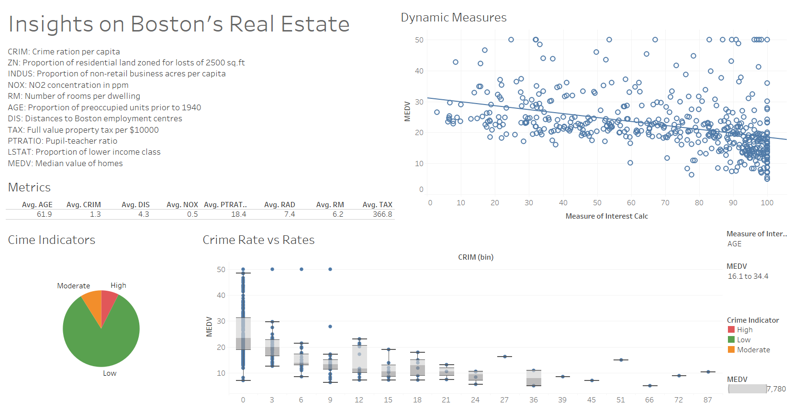

# Boston Real Estate Analysis
Analysis on Boston's Real Estate Data with Tableau

### Dashboard

### Questions Answered
1. How does crime affect the price of real estate?
2. How is proportion of owner-occupied units established prior to 1940 related to the price of real estate?
3. How does the concentration of NO2 in the air affect the price of real estate?
4. Is the number of rooms related to the price of real estate?
5. Is there any relationship between the proportion of lower financial class price drop in real estate?
6. How do the rates fluctuate based on the crime rate in the area?
7. Does your selection range of price impact parameters such as the Average Crime Rate and Pupil-Teacher Ratio?
8. What are the Key Performance Indicators?
9. Is there a fixed equation showing the relationship between factors and price?
10. Is there a way to test if crime rates are truly pertinent to the real estate price?

### Data Citation
`Boston housing dataset. Kaggle. Vish Vishal.`
https://www.kaggle.com/datasets/altavish/boston-housing-dataset/
